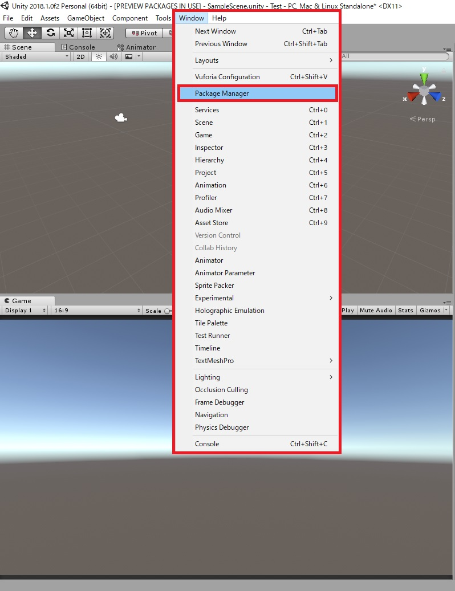

# Unity2018でProBuilderなどをインストールする方法
 - Unity 2018.1.0f2 を使用しています。
 - 今回はProBuilderだけをインストールしていますが、インストールはPostprocessing や TextMeshProなども同じ方法です。
 - <b>ProBuilder</b>の使い方については、他のサイトを参考にしてください。
 

# どこからインストールするの？
 - メニューバーから<b>Window</b>を選択
 - その中にある<b>PackegeManager</b>をクリック
  
 

 

 - <b>Packages</b>タブが出たら<b>All</b>に切り替える
 - その中の<b>ProBuilder</b>をクリック
 - 右上にある<b>install 3.0.8</b>をクリック
 ※ 3.0.8はVersionによって異なります。
 - 少し待つ
 

 

# どこから使うの？
 - インストールが完了するとメニューバーに<b>Tools</b>が表示される
 - <b>Tools</b>から<b>ProBuilder</b>を選択し、<b>ProBuilder Window</b>をクリックしたら<b>ProBuilder</b>が使えます
 - <b>ProBuilder</b>の使い方については、他のサイトを参考にしてください。

  
 
 
